<div style="text-align:center;font-size:2em;font-weight:bold">中国科学技术大学计算机学院</div>

<div style="text-align:center;font-size:2em;font-weight:bold">《数据库系统实验报告》</div>


<div style="display: flex;flex-direction: column;align-items: center;font-size:2em">
<div>
<p>实验题目：xxxxx</p>
<p>学生姓名：xxx</p>
<p>学生学号：PBxxxxxxxx</p>
<p>完成时间：2024年x月x日</p>
</div>
</div>


<div style="page-break-after:always"></div>

# 需求分析

> 描述应用场景，分析所需功能

- 图书馆主要实体为用户和图书。
- 用户包含用于登陆的username、password，用于展示的name。用户可修改自己的所有信息。
- 图书包含标题、封面、评分、简介、作者、可借数量等。
- 用户可以在图书馆中借书、预约、评分。
- 针对一本书的所有评分将会取算数平均数。
- 借走的书会从预约表中删除，逾期的预约不能履行。
- 借走的书归还后，会从预约表中删除。
- 剩余馆藏数为0时，无法借书或预约，对应的事务也不提交。
- 图书馆只有一位管理员，username和password默认为admin，拥有对所有表的增删改权限。管理员同时继承其他普通用户的功能。
# 总体设计

## 系统模块结构
>  如前端和后端两大模块

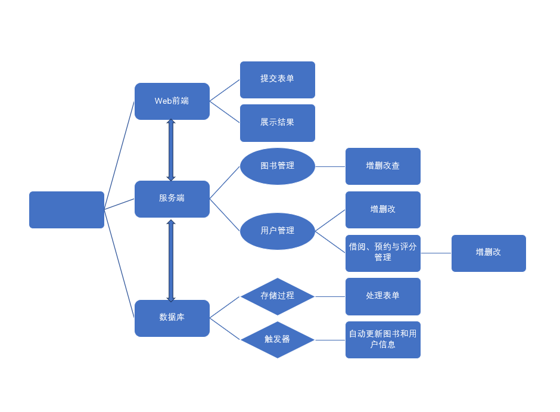

系统模块结构如上图：
- Web前端实现用户交互，提供接口提交表单，渲染界面展示结果
- 服务端采用flask开发，处理Web端的HTTP请求，根据路由规则选择合适的业务模块（图书管理与用户管理），实现具体的业务逻辑（图书和用户的增删改查），并通过flask接口与数据库交互。
- 数据库是MySQL数据库，存储数据，并定义了存储过程和触发器用于更好地操纵数据。
## 系统工作流程

>  可配图
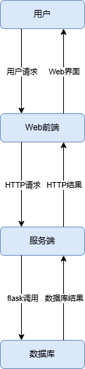

工作流程如上图：
1. 用户通过界面上的UI，向Web前端提交请求。
2. Web前端处理用户请求，转为HTTP请求，向服务端提交。
3. 服务端解析HTTP请求，调用具体业务逻辑，通过flask接口调用数据库。
4. 数据库返回结果给服务端，服务端返回结果给Web前端。
5. Web前端渲染页面，向用户展示结果。

## 数据库设计

> ER图
>
> 模式分解
>
> 存储过程、触发器、函数等设计思路

### ER图
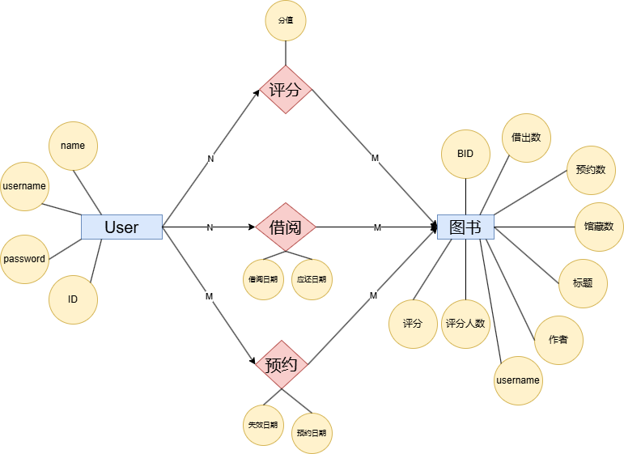

主要实体为用户和图书，用户对图书有评分、借阅、预约三种关系，均为多对多关系。


### 物理模型
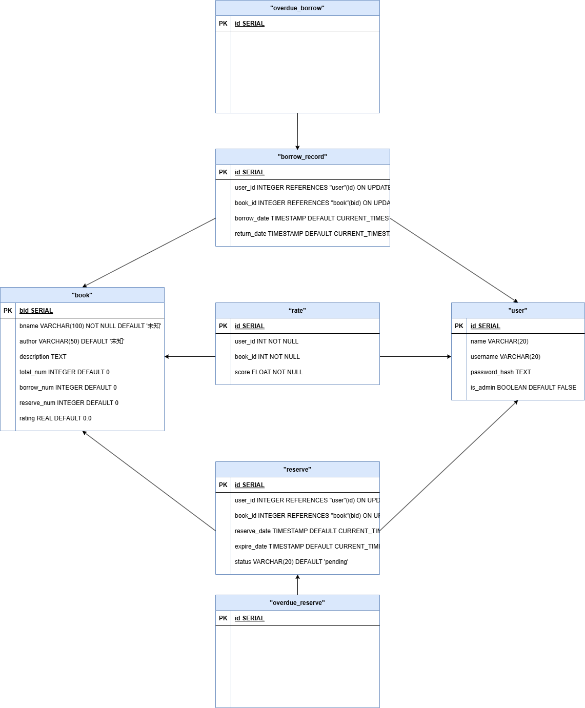

将ER图中的实体、联系都转为关系，得到五张表，如上图：
1. 评分、借阅和预约表都有外键参照图书和用户表。
2. 额外增加两张表存储逾期的预约记录与借阅记录，属性只有ID，外键参照借阅表与预约表，不存储其他信息，尽可能减少冗余。
3. 每张表都有唯一的主键ID，主键直接决定所有其他属性，因此每张表都满足3NF。

### flask建表
flask框架集成了Python的SQLAlchemy库，可以将Python对象转为SQL表。我选择从Python对象创建表，这样方便调用各种Python库，且可以为每个对象设计相应的Python方法（比如用户表的set_password方法）。

#### 用户
```Python
class User(db.Model, UserMixin):
	id = db.Column(db.Integer, primary_key=True)
	name = db.Column(db.String(20))
    username = db.Column(db.String(20))
    password_hash = db.Column(Text)
    is_admin = db.Column(db.Boolean, default=False)
    def set_password(self, password):
        self.password_hash = generate_password_hash(password)
  
    def validate_password(self, password):
        return check_password_hash(self.password_hash, password)
```
用户表包含主键ID、用于登陆的username与password，以及用户自己设置的name。数据库中存储的password是哈希值，用werkzeug库中的函数生成。用户表有两个Python方法，用于设置和验证密码。

#### 图书
```python
class Book(db.Model):
	# 主键是 BID
	bid = db.Column(db.Integer, primary_key=True, autoincrement=True)
	# 书名 bname 不能为空；
	bname = db.Column(db.String(100), nullable=False, default='未知')
	author = db.Column(db.String(50), default='未知')
	description = db.Column(db.Text)
	# 馆藏数量，借出数量和预约数量，默认值为 0；
	total_num = db.Column(db.Integer, default=0)
	borrow_num = db.Column(db.Integer, default=0)
	reserve_num = db.Column(db.Integer, default=0)
	# rating 表示图书的评分，默认为0.0
	rating = db.Column(db.Float, default=0.0)
	# rating_num 表示评分的人数，默认为10
	rating_num = db.Column(db.Integer, default=0)
```
图书表包含的属性如下：
1. 主键bid
2. 图书标题bname
3. 作者名
4. 书籍简介
5. 馆藏数量、借出数量和预约数量
6. 评分和点评人数
本次实验使用的测试数据是我在上学期Web信息处理课程上，从豆瓣爬下来的数据。测试数据中每本书的评分人数设置为10，不过新添加的书评分人数会设置为0。

#### 借阅表、预约表与评分表
```Python
class Rate(db.Model):

    id = db.Column(db.Integer, primary_key=True, autoincrement=True)

    # 评分的用户 UID

    user_id = db.Column(db.Integer, db.ForeignKey('user.id', ondelete='CASCADE', onupdate='CASCADE'))

    # 评分的书籍 BID

    book_id = db.Column(db.Integer, db.ForeignKey('book.bid', ondelete='CASCADE', onupdate='CASCADE'))

    # 评分的数值，范围为 0-10

    score = db.Column(db.Float, nullable=False)

    def __repr__(self):

        return f'<Rating {self.user} rated {self.book} as {self.score}>'

# 声明借书表

class BorrowRecord(db.Model):

    id = db.Column(db.Integer, primary_key=True)

    user_id = db.Column(db.Integer, db.ForeignKey('user.id', onupdate="CASCADE", ondelete="CASCADE"), nullable=False)

    book_id = db.Column(db.Integer, db.ForeignKey('book.bid', onupdate="CASCADE", ondelete="CASCADE"), nullable=False)

    borrow_date = db.Column(db.DateTime, default=db.func.current_timestamp())

    return_date = db.Column(db.DateTime, default=datetime.now() + timedelta(days=7))

  

class Reserve(db.Model):

    id = db.Column(db.Integer, primary_key=True)

    user_id = db.Column(db.Integer, db.ForeignKey('user.id', onupdate="CASCADE", ondelete="CASCADE"), nullable=False)

    book_id = db.Column(db.Integer, db.ForeignKey('book.bid', onupdate="CASCADE", ondelete="CASCADE"), nullable=False)

    reserve_date = db.Column(db.DateTime, default=db.func.current_timestamp())

    expire_date = db.Column(db.DateTime, nullable=False, default=datetime.now() + timedelta(days=7))

    status = db.Column(db.String(20), default='pending')
```
这三张表类似，都有外键参照图书表和用户表，且有一些自己的属性，具体请看物理模型图。
使用SQLAlchemy框架时，为属性设置db.ForeignKey即可实现外键参照，设置ondelete="CASCADE"可以实现级联删除。

#### 逾期表
```python
class overdue_borrow(db.Model):

    id = db.Column(db.Integer, db.ForeignKey('borrow_record.id', onupdate="CASCADE", ondelete="CASCADE"), primary_key=True)

  

class overdue_reserve(db.Model):

    id = db.Column(db.Integer, db.ForeignKey('reserve.id', onupdate="CASCADE", ondelete="CASCADE"), primary_key=True)
```
只有主键一个属性，参照借阅表或者预约表。

### 触发器
当在借阅表、预约表与评分表进行增删改操作时，需要同步更新图书表中的信息。我在MySQL中定义了七个触发器来同步更新，分别处理借阅表、预约表与评分表的插入与删除，以及评分表的修改七种情况。这些触发器定义在 `trigger.sql` 文件中。举例如下：
```SQL
DELIMITER //

-- DROP TRIGGER IF EXISTS Rate_Update_Trigger;

CREATE TRIGGER Rate_Update_Trigger

AFTER UPDATE ON Rate

FOR EACH ROW

BEGIN

    UPDATE Book

    SET rating = (rating * rating_num - OLD.score + NEW.score) / rating_num

    WHERE BID = NEW.book_ID;

END; //

DELIMITER ;
```
这个触发器在用户修改评分时触发，重新计算图书表中的评分（图书表中是所有用户对此书评分的算术平均数）。

### 存储过程
在Python代码中实现各种逻辑比MySQL中方便很多，可以使用对应的库。因此本次实验的大多数业务逻辑通过Python代码实现。但是实验要求使用存储过程，因此实现了添加评分的存储过程，用作示例：
```sql
DELIMITER //

-- DROP PROCEDURE IF EXISTS ADD_RATE;

CREATE PROCEDURE ADD_RATE(IN book_id INT, IN score INT)

BEGIN

    INSERT INTO Rate(book_ID, user_ID, score)

    VALUES (book_id, user_id, score);

END; //

DELIMITER ;
```
当服务端收到添加评分的请求时，会发起一次数据库会话，在会话中调用此存储过程，并传入相应的参数。具体来说，在views.py的rate_sql方法中，用这一句来调用此存储过程：
```
db.session.execute(text(f"CALL ADD_RATE('{book_id}', '{user_id}', '{score}')").execution_options(autocommit=True))
```


## 核心代码解析（可改名为对应模块，如后端实现）

### 仓库地址

> 建议使用github、gitlab、gitee等代码托管网站进行开发，并在**实验验收结束前**设置为**private**，结束后改为**public**

### 目录

> 使用tree命令获取文件结构，并在文件名后用 "-------注释" 解释文件功能
```shell
├─Anchor-Bootstrap-UI-Kit-master -------使用的bootstrap UI模板
│  │  各种模板中的文件
│  ├─assets
│  │  ├─uploads      ----------由用户上传的图片
├─library    -----APP文件
│  │  commands.py    ----------flask命令，可以在命令行中调用     
│  │  models.py      ----------定义数据库
│  │  views.py       ----------路由分发与各种业务逻辑实现
│  │  __init__.py    ----------配置APP各种参数
│  │
│  ├─templates       ----------html文件夹
│  │  │  addbook.html
│  │  │  admin.html
│  │  │  base.html
│  │  │  edit_book.html
│  │  │  edit_borrow.html
│  │  │  edit_rate.html
│  │  │  edit_reserve.html
│  │  │  edit_user.html
│  │  │  index.html
│  │  │  login.html
│  │  │  myerror.html
│  │  │  rate.html
│  │  │  register.html
│  │  │  search.html
│  │  │  user_info.html
│  │  │
│  │  └─errors
│  │          400.html
│  │          403.html
│  │          404.html
|
├─trigger.sql
├─requirement.txt
```

> 分为若干个标题，以一定逻辑顺序讲解代码，如按ER图实体、关系讲解数据库建模代码，按存储过程、触发器分类讲解代码、按前端实现、接口等讲解前端代码
>
> 注意不要无脑粘贴代码，选取具有代表性的代码讲解，并注明文件来源，如首行注释: // backend\models.py
### Web前端

Web前端采用bootstrap框架编写，使用了网上下载的模板Anchor UI（[链接](https://mb.bootcss.com/themes/anchor/index.html)）。flask集成的jinja2可以在html中方便地插入循环逻辑、python变量等，只需在html文本中以{{}}调用即可。

#### 图书馆主页
主页采用bootstrap的card外观展示所有图书，代码如下：
```html
# from index.html
<section class="pt-5 pb-5" data-aos="fade-down">

    <div class="container">

        <!-- Featured -->

        <div class="row">

            

            <div class="col-lg-6">

                <div class="card flex-md-row mb-4 box-shadow h-xl-300">

                        <div class="card-body d-flex flex-column align-items-start">

                            <strong class="d-inline-block mb-2 text-success">剩余馆藏数：{{ book.total_num - book.borrow_num - book.reserve_num}}</strong>

                            <h3 class="mb-0">

                            <a class="text-dark" href="#">{{ book.bname }}</a>

                            </h3>

                            <div class="mb-1 text-muted">

                                {{ book.author }}

                                <div class="mb-1 text-orange">

                                    评分：{{ book.rating|round(2) }}

                                </div>

                            </div>

                            <p class="card-text mb-auto">

                                {{ book.description }}

                            </p>

                            <div class="d-flex align-items-center">

                                

                                <a class="btn btn-info btn-round btn-sm" href="{{ url_for('edit_book', book_id=book.bid) }}">Edit</a>

                                <form class="inline-form ml-2" method="post" action="{{ url_for('delete_book', book_id=book.bid) }}">

                                    <input class="btn btn-info btn-round btn-sm" type="submit" name="delete" value="Delete" onclick="return confirm('Are you sure?')">

                                </form>

                                

                                

                                <a class="btn btn-info btn-round btn-sm ml-2" href="{{ url_for('borrow', book_id=book.bid) }}">Borrow</a>

                                <a class="btn btn-info btn-round btn-sm ml-2" href="{{ url_for('reserve', book_id=book.bid) }}">Reserve</a>

                                <a class="btn btn-info btn-round btn-sm ml-2" href="{{ url_for('rate_sql', book_id=book.bid) }}">Rate</a>

                                

                            </div>

                            <a class="text-gray" href="https://book.douban.com/subject_search?search_text={{ book.bname }}">在豆瓣中搜索</a>

                        </div>

                        

                </div>

            </div>

            

        </div>
```
代码中的{}中的books列表由服务端返回。
flask_login库支持用户登录，登录用户可用{currrent_user}访问，对应参数可用于判断用户是否登录，以及是否为管理员。这样就实现了简单的权限控制。
在图书馆主页中，未登录用户只能看到图书信息，登录用户会显示借阅、预约与评分按钮，管理员会额外显示编辑和删除按钮。具体请看实验结果部分。
点击按钮可以跳转到相应的页面，并根据路由分发规则调用对应Python函数。flask支持从当前界面传递函数参数。比方说，指定按钮属性 `href="{{ url_for('edit_book', book_id=book.bid) }}"` ，可以跳转到edit_book并调用对应方法，参数为当前的book.bid。

#### 提交表单
采用bootstrap的form类提交表单，比方说，搜索界面的表单如下：
```html
# from search.html
<form method="post" action="{{url_for('search')}}">
    <input type="text" name="author" id="author" placeholder="请输入作者"> <br><br>
    <input type="text" name="title" id="title" placeholder="请输入标题"> <br><br>
    <input type="submit" value="搜索">
</form>
```
具体的处理逻辑都在服务端。

#### 管理员界面
管理员界面以table类展示数据库的所有信息，并有对应的增删改按钮。比方说，展示所有用户的代码如下：
```html
# from admin.html
<h1> 用户表 </h1>

<table class="table">

    <thead class="thead-dark">

    <tr>

        <th scope="col"> ID      </th>

        <th scope="col"> username   </th>

        <th scope="col"> Name   </th>

        <th scope="col"> #  </th>

    </tr>

    </thead>

    

    <tbody>

    <tr>

        <td> {{ user.id }} </td>

        <td> {{ user.username }} </td>

        <td> {{ user.name }} </td>

        <td>

            <div class="d-flex align-items-center">

                <a class="btn btn-info btn-round btn-sm" href="{{ url_for('edit_user', user_id=user.id) }}">Edit</a>

                <form class="inline-form ml-2" method="post" action="{{ url_for('delete_user', user_id=user.id) }}">

                    <input class="btn btn-info btn-round btn-sm" type="submit" name="delete" value="Delete" onclick="return confirm('Are you sure?')">

                </form>

            </div>

        </td>

    </tr>

    

    </tbody>

</table>
```
#### 用户界面
用户个人主页以table展示个人信息，并以card展示借书表、预约表，card上有对应的还书、取消等按钮。逾期的借书和预约信息会标注“已逾期！”，并隐藏对应按钮（具体逻辑见需求分析）。

### 服务端
用flask开发服务端，本小节展示的代码均在views.py中。
#### 路由分发
flask提供了简单的路由分发实现，以下面的方法为例：
```python
@app.route('/myerror', methods=['GET', 'POST'])

def myerror(msg):

    return render_template('myerror.html', message=msg)
```
当访问 `/myerror` 地址时调用此函数，展示返回值（即myerror.html），并且将msg传入，在html中可以用 `{{message}}` 调用。

#### 图书管理
图书支持增删改查操作，以查询和添加为例：
```python
@app.route('/search', methods=['POST', 'GET'])

def search():

    author = request.form.get('author')

    title = request.form.get('title')

    # 动态构建查询条件

    query_conditions = []

    if author:

        query_conditions.append(Book.author.like(f"%{author}%"))

    if title:

        query_conditions.append(Book.bname.like(f"%{title}%"))

    books = Book.query.filter(and_(*query_conditions)).all()

    return render_template('search.html', books=books)
```
上面的代码处理查询请求。
1. 首先使用request方法读取Web前端传来的表单信息。
2. 随后构建查询条件。未提交的选项忽视，提交的选项以and连接成查询条件。
3. 之后在Book表中查询。Book表继承了SQLAlchemy中的model类，可以调用它的query方法向数据库提交查询请求。
4. 最后返回search.html文件，查询结果作为参数传入。Web前端随后会渲染html，展示结果。

```python
@app.route('/addbook', methods=['GET', 'POST'])

def addbook():

    if request.method == 'POST':

        bname = request.form.get('bname')

        author = request.form.get('author')

        description = request.form.get('description')

        total_num = request.form.get('total_num')

        borrow_num = request.form.get('borrow_num')

        reserve_num = request.form.get('reserve_num')

        rating = request.form.get('rating')

        image = request.files.get('image')

        book = Book()

        if bname:

            book.bname = bname

        if author:

            book.author = author

        if description:

            book.description = description

        if total_num:

            book.total_num = total_num

        if borrow_num:

            book.borrow_num = borrow_num

        if reserve_num:

            book.reserve_num = reserve_num

        if rating:

            book.rating = rating

        db.session.add(book)

        db.session.commit()

        if image:

            if not os.path.exists(app.config['UPLOAD_FOLDER']):

                os.makedirs(app.config['UPLOAD_FOLDER'])  # 自动创建目录

            image.save(os.path.join(app.config['UPLOAD_FOLDER'], str(book.bid) + '.' + image.filename.rsplit('.', 1)[1].lower()))

        db.session.commit()

        flash('Add book success.')

        return redirect(url_for('admin'))

    return render_template('addbook.html')
```
上面的代码处理添加请求：
1. 首先展示add_book界面，等用户提交表单后，解析表单信息。
2. 创建一个新的图书实体book。
3. 表单中有内容的属性设为输入值，无内容的忽略，数据库会填入默认值。
4. 对于上传的图片，以主键BID为名存储到app的upload文件夹中（在__init.py中配置）。
5. 属性赋值结束后，用 `db.session.add(book)` 将book加入图书表，使用 `db.session.commit()` 提交对话。flask的session在请求中第一次进行数据操作时自动创建，一次session可以包含多次事务。未提交的事务将会自动回滚。
6. 随后返回管理员页面（添加图书需要管理员权限）。

#### 用户管理
##### 用户的增删改
与图书的增删改类似，只以修改为例说明：
```python
@app.route('/User/edit/<int:user_id>', methods=['GET', 'POST'])

@login_required

def edit_user(user_id):

    user = User.query.filter_by(id=user_id).first()

    if request.method == 'POST':

        username = request.form.get('username')

        password = request.form.get('password')

        name = request.form.get('name')

        if username:

            user.username = username

        if password:

            user.set_password(password)

        if name:

            user.name = name

        db.session.commit()

        flash('Item updated.')

        return redirect(url_for('user_info'))

  

    return render_template('edit_user.html', user=user)
```
修改时只处理有提交内容的表单。若要修改密码，需要调用user类的set_password方法。修改结束后，返回用户个人信息界面。

##### 借阅、预定与预约管理
以借书为例：
```python
@app.route('/borrow/<int:book_id>', methods=['POST', 'GET'])

@login_required

def borrow(book_id):

    book = Book.query.filter_by(bid=book_id).first()

    if book:

        if book.borrow_num + book.reserve_num >= book.total_num:

            return myerror('The book is not available.')

        borrow = BorrowRecord.query.filter_by(user_id=current_user.get_id(), book_id=book_id).first()

        if borrow:

            return myerror('You have borrowed this book.')

        borrow = BorrowRecord(user_id=current_user.get_id(), book_id=book_id)

        db.session.add(borrow)

        reserve = Reserve.query.filter_by(user_id=current_user.get_id(), book_id=book_id).first()

        if reserve:

            db.session.delete(reserve)

        db.session.commit()

    flash('Borrow success.')

    return redirect(url_for('user_info'))
```

1. 获取表单并解析信息，查找要借的书。
2. 构造新的borrow_record实体，修改对应属性为输入值。
3. 用 `db.session.add(borrow)` 添加。
4. 如果此书已被此用户预约，则从预约表中删除。
5. 提交对话。
6. 返回用户信息界面。

### 数据库
数据库中的表以python对象定义并导入，具体见数据库设计中flask建表一节。
触发器和存储过程以sql语句创建，具体见数据库设计中触发器一节。

### 测试
在test.py中有一些简单的测试代码。但是连接数据库的测试比较麻烦，而且之前没有写测试的经验，大多数功能是手动测试的。

## 实验与测试

### 依赖

> 所需的库、运行环境

见提交文件中的 `requirement.txt` 文件。
主要的库为flask，以及基于flask开发的flask_login等库。

### 部署

> 代码运行步骤，建议使用命令行运行代码

1. 创建MySQL数据库，并在 `__init.py__` 的config类中配置数据库连接。默认的用户名和密码为 root，数据库名为flask_app。
2. 打开数据库连接，运行 `trigger.sql` 文件定义存储过程。
3. 进入lab2目录。
4. 使用以下命令创建数据库，并执行下面的命令，初始化数据库并导入测试数据：`flask --app library initdb`，`flask --app library forge`
5. 使用以下命令，以调试模式打开APP：`flask --app library run --debug`
6. 在浏览器中访问 http://127.0.0.1:5000
7. 默认管理员的密码和用户名均为admin，如果要修改，可以执行以下命令：`flask --app library admin`

### 实验结果

> 如增删改查、验证存储过程、函数、触发器、文件管理

#### 主页展示
主页如图：


注册界面展示：
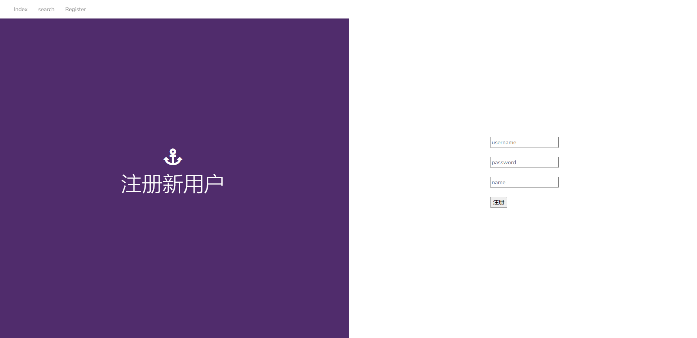

登陆后添加了借书、预约和评分按钮，且添加登出按钮：
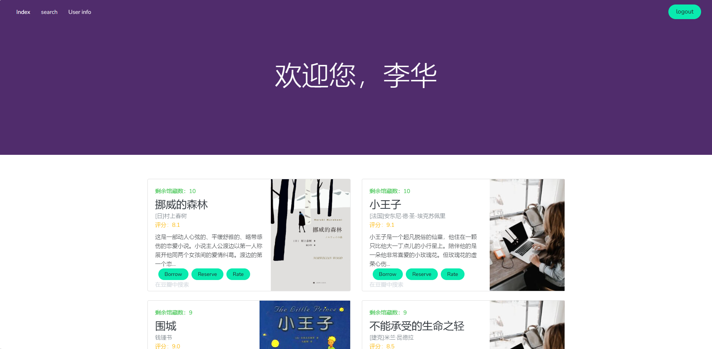

#### 个人主页展示
个人主页展示个人信息、借书表与预约表：
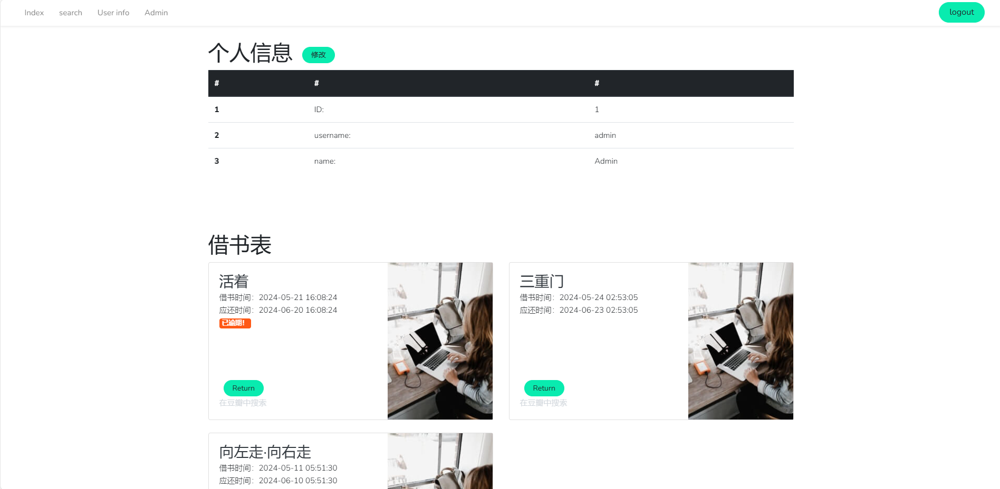


#### 查询界面展示
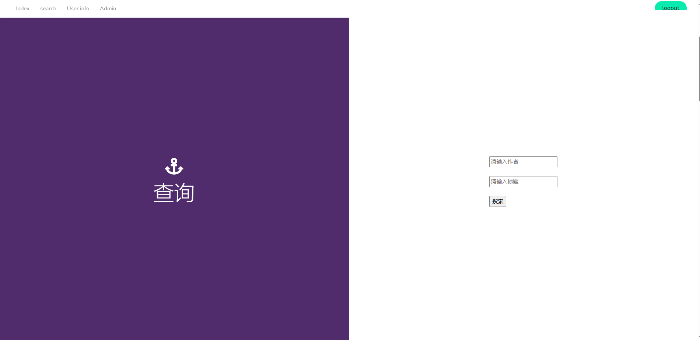

查询结果展示：
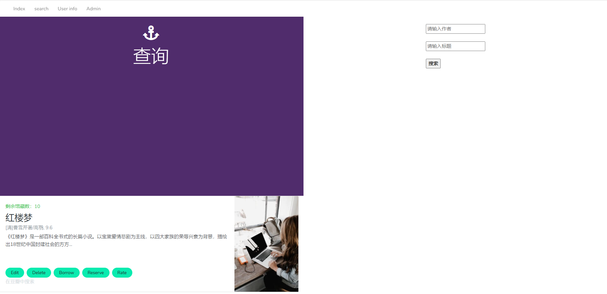

#### 管理员界面展示
管理员界面可执行所有表的增删改：
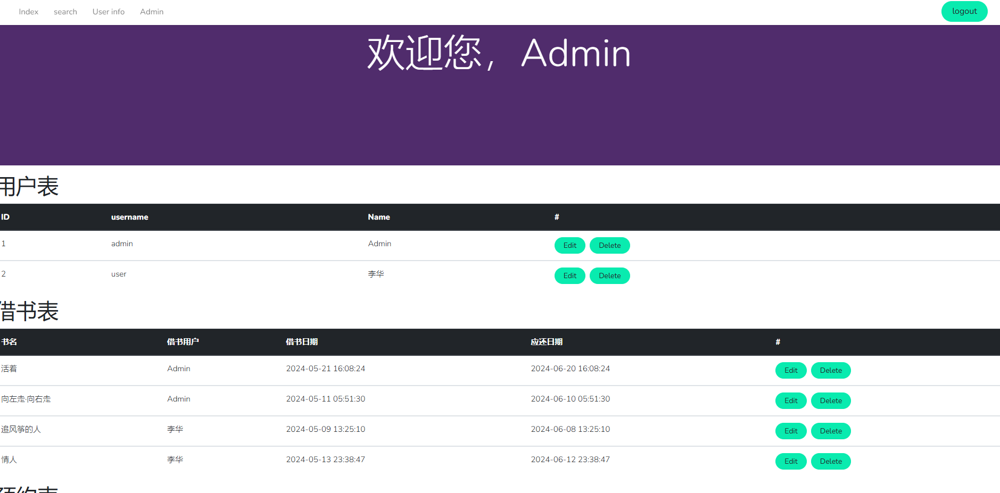

非管理员顶部导航栏不会显示此界面，如果从地址进入，会提示无权限：
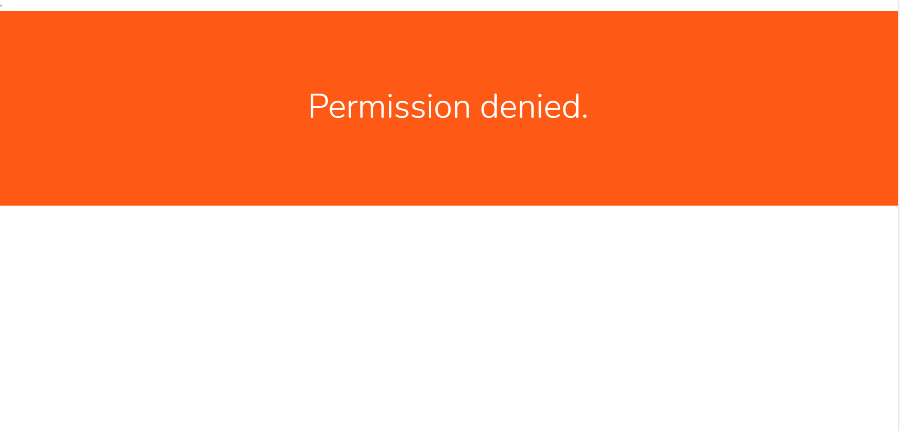

#### 测试还书
在个人主页，点击还书后，从借书表中删除此书：
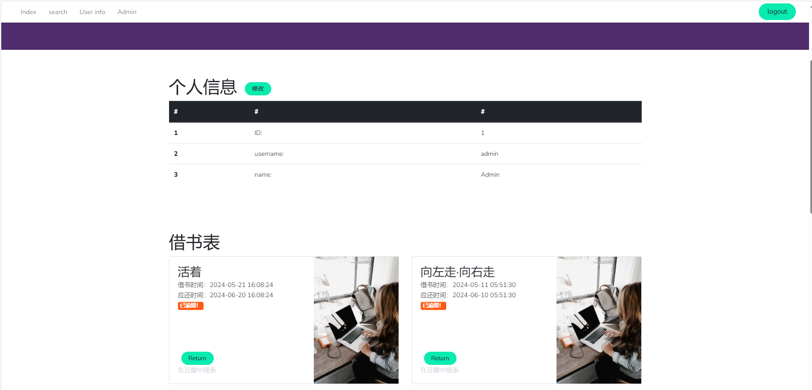

#### 测试添加新图书
点击管理员界面图书表旁的ADD按钮，添加新图书，提交表单后，在主页查看：
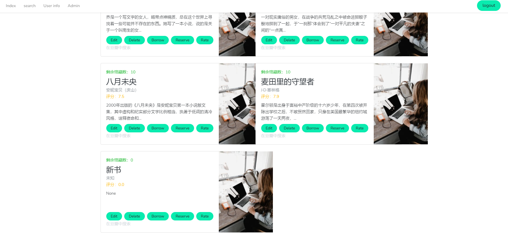

#### 测试文件管理
修改新图书的封面为小王子封面，测试文件管理：
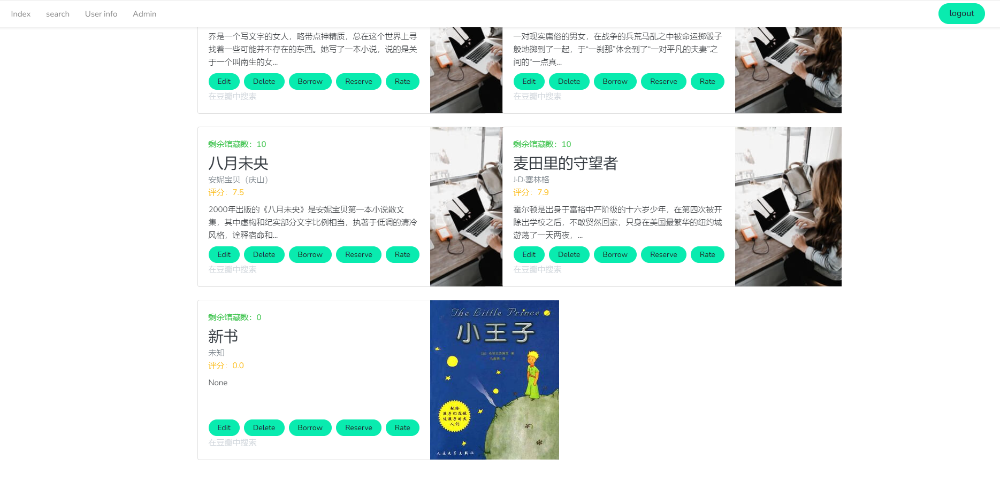

#### 测试触发器
对挪威的森林评分，测试触发器：
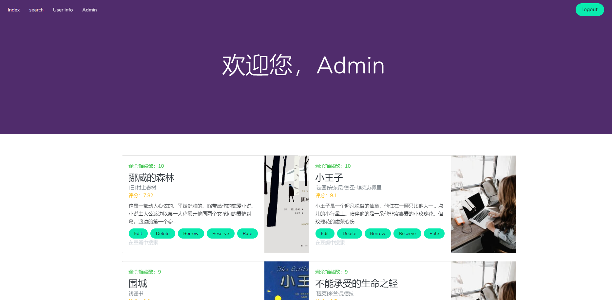

#### 测试级联删除
删除用户李华并测试借阅表的级联删除。

删除前：
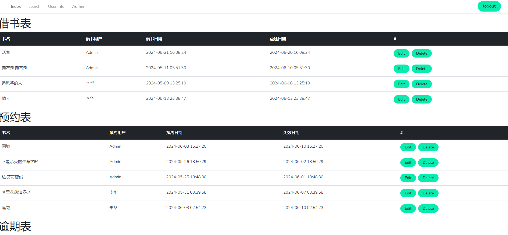

点击Delete按钮删除后：
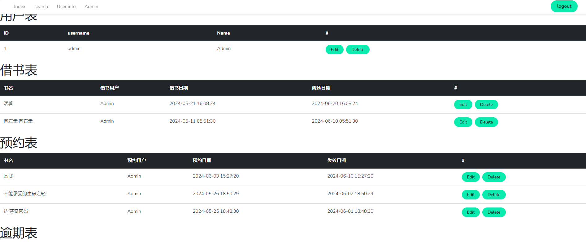

#### 测试报错
新加入的书馆藏为0，点击borrow借阅此书，会报错：
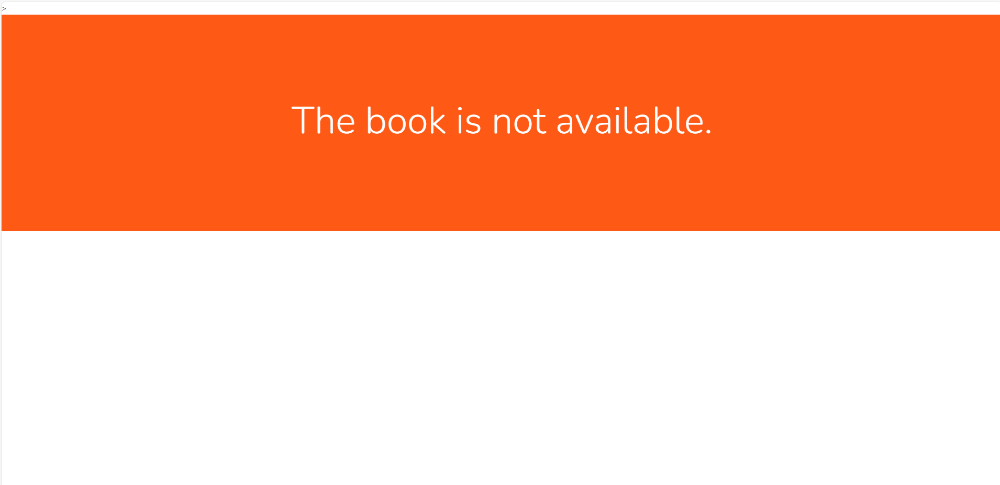

## 参考

> 如前端使用的模板、引用的图片来源、第三方库的官网等等

1. 前端使用的模板：[链接](https://mb.bootcss.com/themes/anchor/index.html)
2. 测试数据来源：[豆瓣读书 Top 250 (douban.com)](https://book.douban.com/top250?start=)。由于数据是上学期爬取的，现在这个榜单的排名已经有一些变化。
